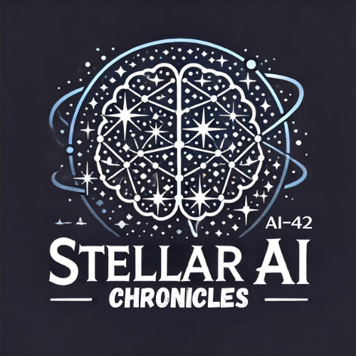

# Stellar AI Chronicles 🌟
**"Journey Through the Stars of AI: Insights, Innovations, and Discoveries"**

Hello, I'm Areefa. Welcome to my Stellar AI Chronicles, where I journal my journey of exploring the fascinating world of AI technology. Along this adventure, I'm not just learning but also sharing my discoveries to spread AI knowledge far and wide.

### Why This Chronicles?
In this era of rapid AI advancements and evolution, it's challenging to stay updated with the latest developments and understand how and where they can solve our problem use cases. My aim is to bridge that gap by providing insightful and innovative articles, case studies, and tutorials.

### What You'll Find Here:
- **🚀 Insights and Innovations**: Dive deep into AI topics with insightful articles and innovative case studies.
- **🌌 Generative AI and Beyond**: Explore the cutting-edge of AI, including Generative AI and other advanced technologies.
- **📚 Tutorials and Guides**: Get hands-on with practical tutorials and guides to sharpen your AI skills.

### Join the Community!
My aim is to grow this as a community where we can learn and innovate together. Here’s how you can be a part of it:
- **🤝 Contribute**: Share your own insights, articles, or tutorials. Fork this repository and submit a pull request to contribute.
- **💬 Engage**: Participate in discussions, ask questions, and share your experiences in AI.
- **📧 Connect**: Reach out to me with suggestions, ideas, or just to chat about AI.

Together, we can explore the stars of AI and make amazing discoveries. Thank you for joining me on this journey. Let's learn, innovate, and grow as a community!

---
